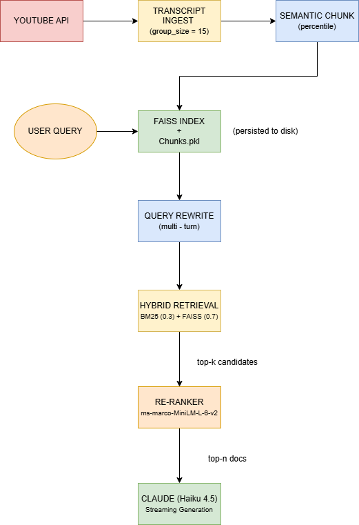
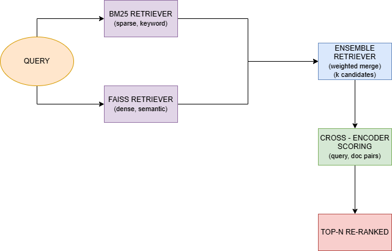
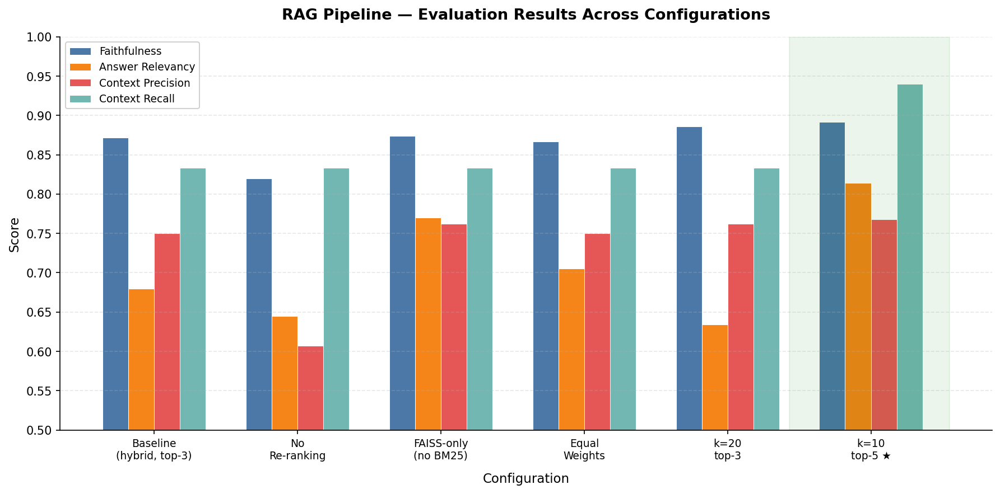

# 🤖 RAG Chatbot — YouTube Transcript Q&A

A **Retrieval-Augmented Generation (RAG)** chatbot that answers questions grounded in **YouTube video transcripts**. Built with **LangChain**, **FAISS**, **BM25**, **cross-encoder re-ranking**, and **Claude** as the generation LLM.

---

## ⭐ Architecture

<!-- ────────────────────────────────────────────────────────────────
     DIAGRAM PLACEHOLDER — Create in draw.io
     
     Diagram 1: End-to-End Pipeline Architecture
     
     Show the full data flow:
     
     ┌──────────────┐    ┌──────────────────┐    ┌────────────────┐
     │ YouTube API  │───▶│ Transcript Ingest │───▶│ Semantic Chunk │
     └──────────────┘    │ (group_size=15)   │    │ (percentile)   │
                         └──────────────────┘    └───────┬────────┘
                                                         │
                              ┌───────────────────────────┘
                              ▼
                    ┌──────────────────┐
                    │  FAISS Index     │  (persisted to disk)
                    │  + chunks.pkl    │
                    └──────────────────┘
                              │
     User Question ──────────▼──────────────────────────────────────────
                    ┌──────────────────┐    ┌──────────────────────────┐
                    │ Query Rewrite    │───▶│ Hybrid Retrieval         │
                    │ (multi-turn)     │    │ BM25 (0.3) + FAISS (0.7)│
                    └──────────────────┘    └────────────┬─────────────┘
                                                         │ top-k candidates
                                                         ▼
                                            ┌──────────────────────────┐
                                            │ Cross-Encoder Re-Rank    │
                                            │ ms-marco-MiniLM-L-6-v2   │
                                            └────────────┬─────────────┘
                                                         │ top-n docs
                                                         ▼
                                            ┌──────────────────────────┐
                                            │ Claude (Haiku 4.5)       │
                                            │ Streaming generation     │
                                            └──────────────────────────┘
     
     Suggested file: docs/architecture.drawio.png
     ──────────────────────────────────────────────────────────────── -->



<!-- ────────────────────────────────────────────────────────────────
     DIAGRAM PLACEHOLDER — Create in draw.io
     
     Diagram 2: Retrieval & Re-Ranking Detail
     
     A zoomed-in view of the retrieval stage:
     
     Query ──┬──▶ BM25 Retriever (sparse, keyword) ──┐
             │                                        ├──▶ EnsembleRetriever ──▶ k candidates
             └──▶ FAISS Retriever (dense, semantic) ──┘        (weighted merge)
                                                                      │
                                                                      ▼
                                                        Cross-Encoder Scoring
                                                        (query, doc) pairs
                                                                      │
                                                                      ▼
                                                              Top-N re-ranked
     
     Suggested file: docs/retrieval-detail.drawio.png
     ──────────────────────────────────────────────────────────────── -->

---

## 🗂️ Project Structure

```
RAG_Chatbot/
├── config.py              # All tuneable parameters in one place
├── ingest.py              # YouTube transcript fetching & grouping
├── pipeline.py            # Index build/load, retrieval, generation (RAGPipeline class)
├── reranker.py            # Cross-encoder re-ranking module
├── main.py                # Interactive streaming chat interface
├── eval.py                # Single-config Ragas evaluation
├── eval_experiments.py    # Multi-config ablation runner
├── eval_dataset.json      # 14 hand-crafted Q&A pairs (3 videos)
├── eval_results/          # Saved experiment JSON outputs
├── faiss_index/           # Persisted FAISS index + BM25 chunks
└── .env                   # API keys (ANTHROPIC_API_KEY)
```

---

## 🧠 Design Decisions

### ✂️ Chunking: Semantic over Fixed-Size

| Strategy | How it splits | Pros | Cons |
|----------|--------------|------|------|
| **Fixed-size** (`RecursiveCharacterTextSplitter`) | Every N characters | Simple, predictable | Cuts mid-thought, merges unrelated content |
| **Semantic** (`SemanticChunker`) | Where embedding similarity drops | Coherent "thought units" | Slower index build, variable chunk sizes |
| Sentence-Window | Single sentences (returns window) | High precision for factoids | Complex setup, needs large window |
| Parent-Document | Small children, returns parent | Broad context | Returns too much irrelevant text |

**Why semantic fits here:** YouTube transcripts are conversational with natural topic shifts. Speakers don't respect character boundaries — thoughts span variable lengths. The downstream cross-encoder benefits from coherent units.

Configuration: `breakpoint_threshold_type="percentile"` — splits where inter-sentence similarity drops below the **95th percentile**.

### 🔎 Retrieval: Hybrid (BM25 + FAISS)

- **Dense retrieval (FAISS)** with `all-MiniLM-L6-v2` embeddings captures semantic similarity.
- **Sparse retrieval (BM25)** catches exact keyword matches embeddings might miss (acronyms, proper nouns, exact phrasing).

Combined via `EnsembleRetriever` with weights **0.3 (BM25)** / **0.7 (FAISS)**.

### 🥇 Re-Ranking: Cross-Encoder

Initial retrieval is fast but imprecise (bi-encoder). A cross-encoder (`ms-marco-MiniLM-L-6-v2`) jointly encodes the **query + candidate chunk**, producing much more accurate relevance scores.

### 🔁 Multi-Turn: Query Rewriting

For follow-up questions, a separate LLM call rewrites the question into a **standalone** query using conversation history. This prevents retrieval from being polluted by pronouns / implicit references.

### 🛡️ Resilience: Retries with Backoff

All external calls (YouTube API, LLM, retriever) are wrapped with `tenacity` retries — **exponential backoff**, **3 attempts**, logging before each retry.

---

## 📊 Evaluation Results

Evaluated on **14 hand-crafted Q&A pairs** across **3 YouTube source videos**.

- 🧑‍⚖️ Judge LLM: **Claude Haiku 4.5**
- 🧩 Embeddings: **all-MiniLM-L6-v2**
- 🧪 Framework: [Ragas](https://docs.ragas.io/)

| Configuration | Faithfulness | Answer Relevancy | Context Precision | Context Recall |
|---------------|:---:|:---:|:---:|:---:|
| Baseline (hybrid 0.3/0.7 + rerank top-3) | 0.872 | 0.680 | 0.750 | 0.833 |
| No re-ranking | 0.820 | 0.645 | 0.607 | 0.833 |
| FAISS-only (no BM25) | 0.874 | 0.770 | 0.762 | 0.833 |
| Equal weights (0.5/0.5) | 0.867 | 0.705 | 0.750 | 0.833 |
| k=20, rerank top-3 | 0.886 | 0.634 | 0.762 | 0.833 |
| ⭐ **k=10, rerank top-5** | **0.892** | **0.814** | **0.768** | **0.940** |

<!-- ────────────────────────────────────────────────────────────────
     DIAGRAM PLACEHOLDER — Create in draw.io
     
     Diagram 3: Evaluation Results Bar Chart
     
     Grouped bar chart with 6 experiment configs on the x-axis and 4 metrics
     as grouped bars. Highlight the winning config (k10_top5).
     
     Alternatively, a radar/spider chart comparing baseline vs best config
     across the 4 metrics.
     
     Suggested file: docs/eval-results-chart.drawio.png
     ──────────────────────────────────────────────────────────────── -->



### ⭐ Key Findings

1. 🥇 **Re-ranking is the biggest quality lever.** Removing it drops context precision by 14 points (0.75 → 0.61) and answer relevancy by 3.5 points.
2. 📈 **More context to the LLM helps significantly.** `k=10, rerank top-5` is best across all metrics. Giving the LLM 5 re-ranked chunks instead of 3 boosted context recall from 0.83 → 0.94.
3. 🧾 **BM25 adds marginal value for transcripts.** FAISS-only scored slightly better on answer relevancy (0.77 vs 0.68). For conversational content, semantic similarity alone is often sufficient.
4. 🎯 **Wider candidate pool helps faithfulness but hurts focus.** k=20 improves faithfulness (0.87 → 0.89) but answers become less relevant due to more noise.
5. ⚖️ **Ensemble weights are not very sensitive.** 0.3/0.7 vs 0.5/0.5 produced similar results, confirming the re-ranker dominates downstream quality.

---

## 🚀 Getting Started

### ✅ Prerequisites

- 🐍 Python **3.11+**
- 🔑 An [Anthropic API key](https://console.anthropic.com/)

### 📦 Installation

```bash
git clone <repo-url>
cd RAG_Chatbot
python -m venv venv
venv\Scripts\activate        # Windows
# source venv/bin/activate   # macOS/Linux

pip install -r requirements.txt  # (see dependencies below)
```

### ⚙️ Configuration

Create a `.env` file:

```env
ANTHROPIC_API_KEY=sk-ant-...
```

All pipeline parameters live in `config.py` — retrieval k, weights, model names, prompts.

### ▶️ Usage

```bash
# Interactive chat (streams responses)
python main.py

# Run evaluation on the 14-question dataset
python eval.py

# Run ablation experiments
python eval_experiments.py --experiment all
python eval_experiments.py --experiment k10_top5
```

---

## 📚 Dependencies

| Package | Purpose |
|---------|---------|
| `langchain`, `langchain-anthropic`, `langchain-huggingface`, `langchain-community`, `langchain-experimental` | Orchestration, LLM, embeddings, retrievers, chunking |
| `faiss-cpu` | Dense vector similarity search |
| `rank-bm25` | Sparse keyword retrieval |
| `sentence-transformers` | Cross-encoder re-ranking model |
| `youtube-transcript-api` | Transcript fetching |
| `ragas` | Evaluation framework (faithfulness, relevancy, precision, recall) |
| `tenacity` | Retry logic with exponential backoff |
| `python-dotenv` | Environment variable management |

---

## 🛠️ What I'd Do Next

### ⭐ Short-term improvements

- ✅ **Persist the best config as default** — update `config.py` to use k=10, top-5 (already done based on eval results)
- 📌 **Add a `requirements.txt` / `pyproject.toml`** — pin exact versions for reproducibility
- 🔗 **Citation formatting** — surface video title + clickable timestamp links in answers instead of raw video IDs
- 🧠 **Conversation memory limits** — cap history to last N turns to avoid prompt bloat

### 🧩 Medium-term

- 🤖 **Agentic retrieval** — let the LLM decide when to retrieve vs answer from memory, and reformulate queries iteratively
- 🏷️ **Chunk metadata enrichment** — add video title, speaker name, topic tags to improve filtering
- 🧪 **Evaluation expansion** — grow the dataset to 50+ questions, add multi-hop and comparison questions
- 🌐 **User-facing API** — wrap in FastAPI with WebSocket streaming for a proper frontend

### 🔬 Longer-term / research

- 🧬 **Fine-tuned embeddings** — train on in-domain (transcript, Q&A) pairs to improve retrieval without re-ranking overhead
- 🧠 **Adaptive chunking** — dynamically choose chunk strategy per video (lecture vs interview vs tutorial)
- 🖼️ **Multi-modal** — incorporate video frames / slides for visual content grounding
- 🔁 **Feedback loop** — collect user thumbs-up/down to continuously improve retrieval and generation

---
